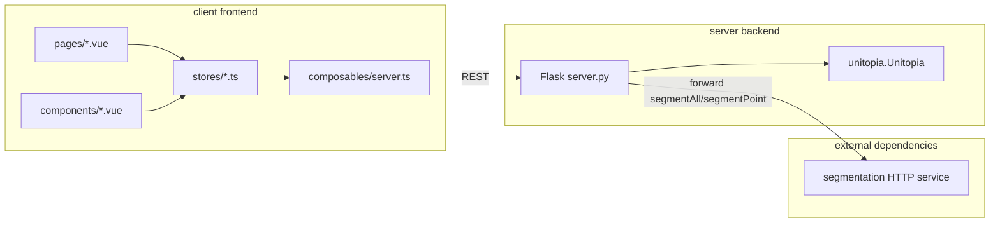

# Unitopia: Design Tool for Pictorial Unit Visualization (VIS 2026)

<div align="center">

### [Paper]() | [Online System](https://unitopia-web.github.io/) | [中文文档](./README_zh.md)

Xinghui Fu<sup>1</sup> · [Zhida Sun](https://zhdsun.github.io/)<sup>1</sup> · Yoojin Jeon<sup>2</sup> · Guozheng Li<sup>3</sup> · [Yu Zhang](https://zhangyu94.github.io/)<sup>4</sup>  · [Bongshin Lee](https://www.bongshiny.com/)<sup>3</sup>  · [Min Lu](https://deardeer.github.io/)<sup>1</sup> 

<sup>1</sup>Shenzhen University · <sup>2</sup>Yonsei University · <sup>3</sup>Beijing Institute of Technology · <sup>4</sup>Huawei Technologies 

</div>


<p align="center">
  
</p>


**UnitoPia** is an interactive construction tool for pictorial unit visualization. In UnitoPia, users can easily create a pictorial unit visualization with a tangible design model called contain-and-fill. The interface of UnitoPia consists of (A) a dataset panel, (B) a mark panel, (C) a resource library, (D) a main canvas, and (E) a pop-out mark design panel. Via sketching and direct manipulation, users can easily define the four components to create a pictorial unit visualization.

## Examples of Pictorial Unit Visualizations 

<p align="center">
  
</p>

With UnitoPia, users can create diverse pictorial unit visualizations with expressive elements and flexible layouts.

## Audience

This document is for:

* Developers who want to deploy UnitoPia on a local server.
* Developers who want to extend or build upon UnitoPia.

If you only want to use and design with UnitoPia, visit our [online system](https://unitopia-web.github.io/#/).

## Tech Stack

The project consists of a **Vue 3** interactive collage editor frontend and a **Flask + Python** backend orchestration service. The backend organizes canvas state into a DSL and invokes the **`unitopia` runtime library** ([unitopia-lib](https://github.com/fxh803/unitopia-lib)) for collage computation; segmentation is powered by SAM2.

---

## Repository Structure

| Directory | Description |
|-----------|-------------|
| `client/` | Frontend: editor, multi-page routing, Pinia state, backend communication (`src/composables/server.ts`) |
| `server/` | Backend: `server.py` entry point, `utils.py` helpers, `data/`, etc.; runtime output written to `workdir/` |
| `example/` | Examples and supplementary materials |
| `sam/` | SAM2-based segmentation service (requires `sam2` install, weights, and separate deployment) |

---

## System Architecture



**Typical Runtime Flow**

1. User actions in the editor update state in **Pinia `stores`**.
2. When the user triggers a run (e.g. Run), **`collectAllSlidesData()`** in `server.ts` walks the current task's layer settings and extracts **markers / container / emitter / forces / dataBinding**, assembling `ProcessedData[]`.
3. **`sendDataToServer()`** POSTs the assembled payload to `/processDataApi`.
4. Backend **`processDataApi`** creates a work directory per collage sub-task under `workdir`, generates marker SVG/PNG assets, container binary masks, and the corresponding DSL `workdir/{id}_collage.json`, then calls **`unitopia.start_collage`**.
5. The frontend polls **`GET /fetchProgressApi?id=...`** for progress and results; when needed, it fetches render primitives via **`GET /getRenderTxtApi`**.

---

## Frontend (`client/`)

### Tech Stack

- Vue 3, Vite, TypeScript, Pinia, Vue Router
- Canvas: **Fabric.js**; additional capabilities: **Paper.js**
- UI: Element Plus, UnoCSS, vxe-table

### Key Directories

| Path | Responsibility |
|------|----------------|
| `src/pages/` | Routed pages: `editor`, `dataset`, `paper`, `gallery`, `userstudy`, etc. |
| `src/components/` | Main Vue components in the editor |
| `src/otherComponents/` | Non-core editor views and miscellaneous components |
| `src/stores/` | Business state and canvas logic (main canvas, custom mark canvas, animation, export, etc.) |
| `src/composables/server.ts` | **Backend communication**: collect slide data, progress polling, container upload, segmentation, marker placement, etc. |

### Local Development

```bash
cd client
pnpm install
pnpm dev
```

The default dev script uses port **3333** (see the `dev` script in `client/package.json`).

### Backend URL Configuration

The frontend points to the API base URL via the **`ip`** constant in `client/src/composables/server.ts`. The repository defaults to a hosted example; for local development, change it to `http://localhost:4444` (matching the default port in `server/server.py`).

---

## Backend (`server/`)

### Tech Stack

- Flask
- **unitopia-lib** core runtime (install separately; see `README.md` and `collage_config_zh.md` in the [unitopia-lib](https://github.com/fxh803/unitopia-lib) repository)

### HTTP API Overview

| Route | Method | Purpose | Primary frontend entry |
|-------|--------|---------|------------------------|
| `/processDataApi` | POST | Accept multi-layer collage tasks, write `workdir` and `*_collage.json`, start `unitopia.start_collage` | `sendDataToServer()` |
| `/fetchProgressApi` | GET | Query progress/result by task `id` (in-memory `progress_data`) | `startProgressTimer()` |
| `/uploadContainerApi` | POST | Upload container image as base64; transparency handling and cropping; return PNG data URL | `sendUploadContainerToServer()` |
| `/markerDropApi` | POST | Generate initial marker placements from container and count | `handleMarkerDropCanvas()` |
| `/getRenderTxtApi` | GET | Read mark list for a task | `getRenderTxtData()` |
| `/segmentAll` | POST | Full-image segmentation: forward to external service, then crop and color masks | `sendBackgroundToSegmentAll()` |
| `/segmentPoint` | POST | Point-based segmentation: same forwarding logic | `sendPointToSegmentPoint()` |
| `/workdir/<path>` | GET | Static access to generated files under `workdir` | Result asset URLs, etc. |
| `/api/images` | GET | Dataset: aggregate structured entries from Excel | `dataset`-related pages |

External segmentation service URLs are currently hard-coded in `server.py` (e.g. `http://175.178.152.10:2616/segmentAll` and `segmentPoint`). Replace them or move to configuration when deploying.

### Local Development

```bash
cd server
# Requires the unitopia package and dependencies installed
python server.py
```

Listens on **`0.0.0.0:4444`** by default with `debug=True` (see the bottom of `server.py`).

### Work Directory

- Task output and intermediate files live under **`server/workdir/`** (created on demand during processing).
- **`processDataApi`** uses a global flag to prevent concurrent re-entry (returns 503 when busy).

---

## Optional: Local Segmentation with `sam/`

`sam/server.py` provides a Flask segmentation service based on **SAM2**, requiring local `sam2` source and checkpoint files. After deployment, update the segmentation request URLs in the main repo's **`server/server.py`** to point to your service.

---

## Related Links

- Application repository: <https://github.com/fxh803/unitopia_2.0>
- Runtime library: <https://github.com/fxh803/unitopia-lib>
- SAM2 reference: <https://github.com/facebookresearch/sam2>

---

## Frontend Template Notes

`client/` is scaffolded from Vitesse Lite. For auto-import, UnoCSS, and other generic setup details, see **`client/README.zh-CN.md`**.
