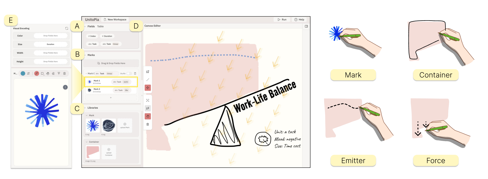
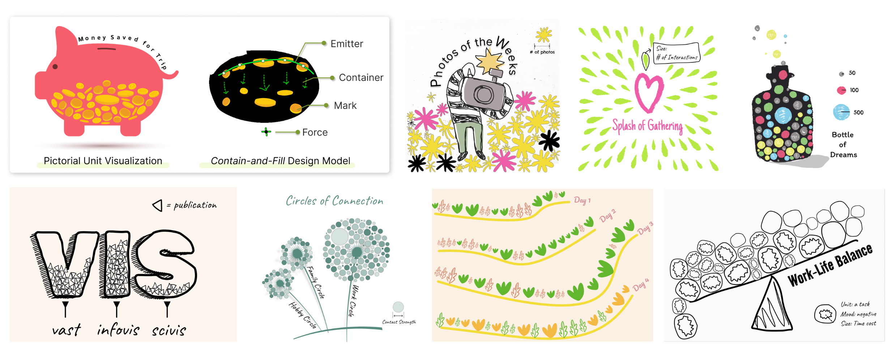
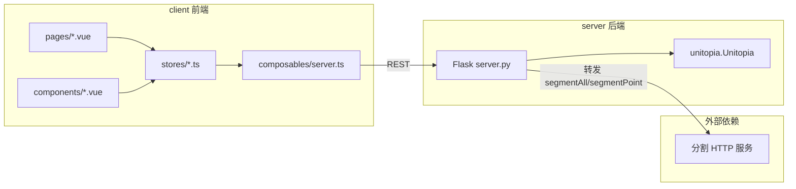

# Unitopia：象形单元可视化设计工具（VIS 2026）

<div align="center">

### [论文]() | [在线系统](https://unitopia-web.github.io/) | [English](./README.md)

Xinghui Fu<sup>1</sup> · [Zhida Sun](https://zhdsun.github.io/)<sup>1</sup> · Yoojin Jeon<sup>2</sup> · Guozheng Li<sup>3</sup> · [Yu Zhang](https://zhangyu94.github.io/)<sup>4</sup>  · [Bongshin Lee](https://www.bongshiny.com/)<sup>3</sup>  · [Min Lu](https://deardeer.github.io/)<sup>1</sup> 

<sup>1</sup>深圳大学 · <sup>2</sup>延世大学 · <sup>3</sup>北京理工大学 · <sup>4</sup>华为技术有限公司

</div>


<p align="center">
  
</p>


**UnitoPia** 是一款用于象形单元可视化的交互式构建工具。在 UnitoPia 中，用户可以通过名为 contain-and-fill 的可触式设计模型，轻松创建象形单元可视化。UnitoPia 的界面包含 (A) 数据集面板、(B) 标记面板、(C) 资源库、(D) 主画布和 (E) 弹出式标记设计面板。通过草图绘制与直接操作，用户可以方便地定义四个组件，从而创建象形单元可视化。

## 象形单元可视化示例

<p align="center">
  
</p>

借助 UnitoPia，用户可以使用丰富的表达元素和灵活的布局，创建多样化的象形单元可视化。

## 文档阅读对象

本文档面向：

* 希望在本地服务器部署 UnitoPia 的开发者。
* 希望基于 UnitoPia 进行二次开发的开发者。

若您仅希望使用 UnitoPia 进行设计，请访问我们的[在线系统](https://unitopia-web.github.io/#/)。

## 技术栈

基于 **Vue 3** 的交互式拼贴编辑前端，与 **Flask + Python** 的后端编排服务组成。后端将画布状态整理为 DSL，调用 **`unitopia` 运行库**（[unitopia-lib](https://github.com/fxh803/unitopia-lib)）执行拼贴计算；分割相关能力由 SAM2 提供。

---

## 仓库结构

| 目录 | 说明 |
|------|------|
| `client/` | 前端：编辑器、多页面路由、Pinia 状态、与后端通信（`src/composables/server.ts`） |
| `server/` | 后端：`server.py` 入口，`utils.py` 工具函数，`data/` 等；运行结果写入 `workdir/` |
| `example/` | 示例与辅助材料 |
| `sam/` | 基于 SAM2 的分割服务（需安装 `sam2` 与权重并单独部署） |

---

## 系统架构（前后端对照）



**典型运行流程**

1. 用户在编辑器中操作，状态落在 **Pinia `stores`**。
2. 用户触发运行（如 Run）时，`server.ts` 中 **`collectAllSlidesData()`** 按当前任务遍历每个层级设置，抽取 **markers / container / emitter / forces / dataBinding** 等数据，组装为 `ProcessedData[]`。
3. **`sendDataToServer()`** 向 `POST /processDataApi` 发送组装好的数据。
4. 后端 **`processDataApi`** 为每个 collage 子任务在 `workdir` 创建工作目录，生成 marker 的 SVG/PNG、container 二值图等资源，并生成对应 DSL `workdir/{id}_collage.json`，调用 **`unitopia.start_collage`**。
5. 前端轮询 **`GET /fetchProgressApi?id=...`** 更新进度与结果；需要时先通过 **`GET /getRenderTxtApi`** 拉取渲染图元等。

---

## 前端（`client/`）

### 技术栈

- Vue 3、Vite、TypeScript、Pinia、Vue Router
- 画布：**Fabric.js**；部分能力：**Paper.js**
- UI：Element Plus、UnoCSS、vxe-table

### 目录要点

| 路径 | 职责 |
|------|------|
| `src/pages/` | 路由页面：`editor`、`dataset`、`paper`、`gallery`、`userstudy` 等 |
| `src/components/` | 编辑器内主要 Vue 组件 |
| `src/otherComponents/` | 非核心编辑器视图或杂项组件 |
| `src/stores/` | 业务状态与画布逻辑（主画布、自定义 mark 画布、动画、导出等） |
| `src/composables/server.ts` | **与后端通信**：收集 slide 数据、进度轮询、容器上传、分割、marker 落点等 |

### 本地运行

```bash
cd client
pnpm install
pnpm dev
```

默认开发脚本使用端口 **3333**（见 `client/package.json` 中 `dev` 脚本）。

### 后端地址配置

前端通过 `client/src/composables/server.ts` 中的 **`ip`** 常量指向 API 基址；仓库中默认示例为线上地址，本地联调可改为 `http://localhost:4444`（与 `server/server.py` 默认端口一致）。

---

## 后端（`server/`）

### 技术栈

- Flask
- **unitopia-lib** 核心运行库（需提前安装，详见 [unitopia-lib](https://github.com/fxh803/unitopia-lib) 仓库内 `README.md` 与 `collage_config_zh.md`）

### HTTP 接口一览（与前端调用对应）

| 路由 | 方法 | 作用 | 前端主要入口 |
|------|------|------|----------------|
| `/processDataApi` | POST | 接收多层级拼贴任务，写 `workdir` 与 `*_collage.json`，启动 `unitopia.start_collage` | `sendDataToServer()` |
| `/fetchProgressApi` | GET | 按任务 `id` 查询进度/结果（内存 `progress_data`） | `startProgressTimer()` |
| `/uploadContainerApi` | POST | 上传容器图 base64，透明处理与裁剪后返回 PNG data URL | `sendUploadContainerToServer()` |
| `/markerDropApi` | POST | 根据容器与数量生成 marker 初始落点 | `handleMarkerDropCanvas()` |
| `/getRenderTxtApi` | GET | 读取某任务 mark 列表 | `getRenderTxtData()` |
| `/segmentAll` | POST | 全图分割：转发至外部分割服务，再对 mask 做裁剪与着色处理 | `sendBackgroundToSegmentAll()` |
| `/segmentPoint` | POST | 点选分割：同上转发逻辑 | `sendPointToSegmentPoint()` |
| `/workdir/<path>` | GET | 提供 `workdir` 下生成文件的静态访问 | 结果资源链接等 |
| `/api/images` | GET | Dataset 用：从 Excel 聚合结构化条目 | `dataset` 相关页面 |

外部分割服务地址当前写在 `server.py` 内（例如 `http://175.178.152.10:2616/segmentAll` 与 `segmentPoint`）；部署时请按环境替换或改为配置项。

### 本地运行

```bash
cd server
# 需已安装 unitopia 包及上述依赖
python server.py
```

默认监听 **`0.0.0.0:4444`**，`debug=True`（见 `server.py` 末尾）。

### 工作目录

- 任务输出与中间文件位于 **`server/workdir/`**（若不存在会在处理时创建）。
- 同一时刻 **`processDataApi`** 通过全局标志避免并发重入（忙时返回 503）。

---

## 可选：`sam/` 本地分割

`sam/server.py` 提供了基于 **SAM2** 的 Flask 分割服务，需依赖本地的 `sam2` 源码及 checkpoint 文件。完成部署后，请将主仓库 **`server/server.py`** 中分割相关请求的 URL 修改为当前服务的实际地址，以实现分割功能的对接。

---

## 相关链接

- 系统前后端仓库：<https://github.com/fxh803/unitopia_2.0>
- 运行库仓库：<https://github.com/fxh803/unitopia-lib>
- SAM2 参考：<https://github.com/facebookresearch/sam2>

---

## 更多前端模板说明

`client/` 基于 Vitesse Lite 脚手架，组件自动导入、UnoCSS 等通用说明见 **`client/README.zh-CN.md`**。
